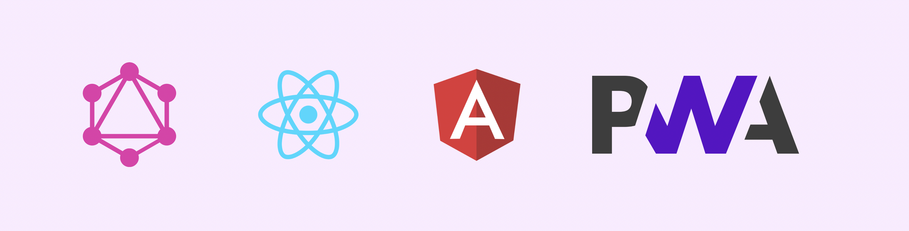

 

## Hello World 👋🏼

I'm Aman - SSE at [@Atlassian](http://github.com/atlassian). I love to read and talk about React, GraphQL, Microfrontends. If you have some weired use caeses to solve I can help.

## Things I do

- Frontend Development
- µFrontends
- GraphQL
- Angular to React Migraion
- Ionic to React Native Migration
- GraphQL Coaching
- Mentor

 

 

 

⚙️ My Neovim Config [amankumarsaini28/neovim](https://github.com/amankumarsaini28/neovim)

👉🏼 Get in touch with me on [LinkedIn](https://www.linkedin.com/in/thejsguy)

📝 Read my thoughts on [Medium](https://medium.com/@amankumarsaini28) 
